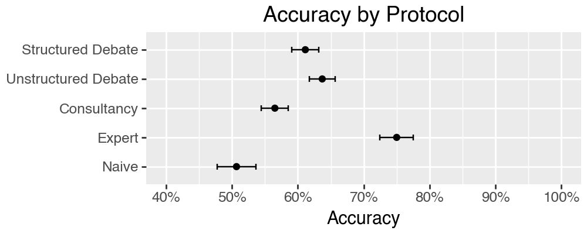
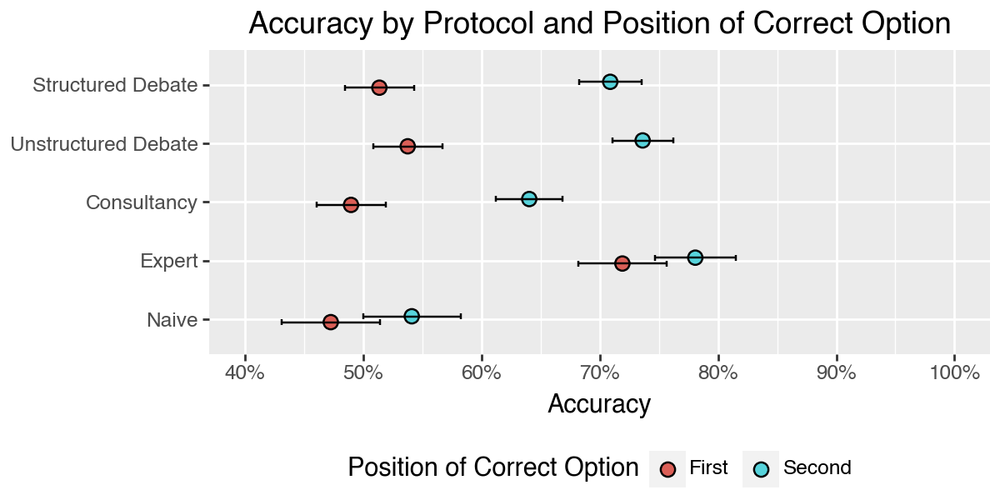
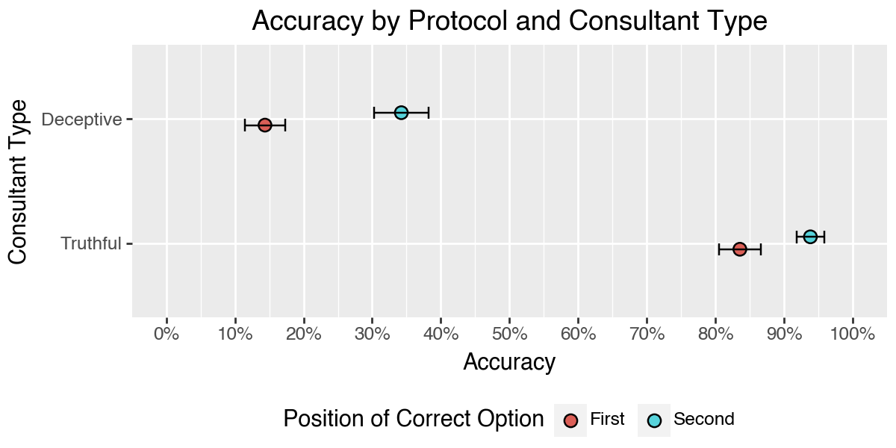
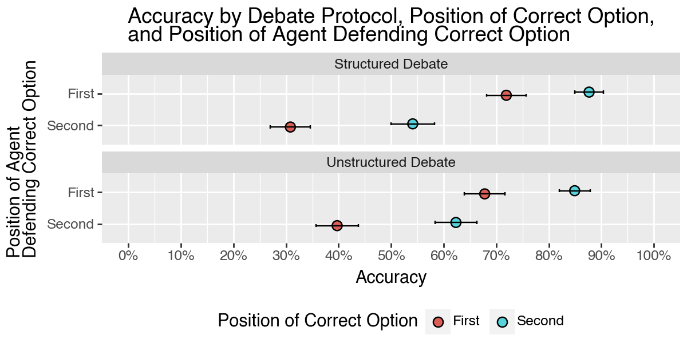
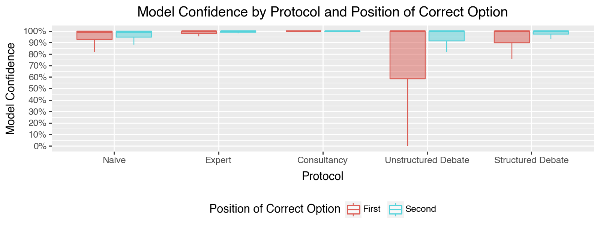

# Positional Bias in AI Alignment Debates

## TLDR; for anyone interested in using debate as a method of AI oversight.
  * Positional bias should absolutely be taken into account when designing debate experiments and evaluations, and this
    includes not only the order in which options are presented, but also the order in which agents speak.
  * To reduce the likelihood of "self-defeating behavior", where one AI debater prematurely concedes to the other, 
    it may be beneficial to provide prompt scaffolding that steers the agents, and judge through each round. 
  * I would recommend using [AutoGen](https://microsoft.github.io/autogen/stable/index.html) to facilitate the creation 
    of this scaffolding, rather than attempting to implement debates from scratch.
    * You can use the debate protocols I implemented in this [repo](debate-for-ai-alignment/src/debate_for_ai_alignment/pipelines/debate) 
      as a starting point if you're curious about using [AutoGen](https://microsoft.github.io/autogen/stable/index.html) for this purpose.
  * You can view all the debate transcripts for the experiments I conducted in a web app [here](https://quality-data-debate-app.onrender.com/).

## Overview
This repository is my capstone project for the [AI Alignment Course](https://aisafetyfundamentals.com/alignment/) 
offered by Blue Dot Impact, where I replicate some of the experiments described in the paper,
[Debating with More Persuasive LLMs Leads to More Truthful Answers](https://arxiv.org/abs/2402.06782), with a particular
focus on the impact of positional bias on the outcome of debates involving an LLM judge powered by **gpt-4o-mini-2024-07-18**.

In that paper, the authors investigate various debate settings as a tool to enable non-experts to evaluate
the output of experts. Here, we investigate the impact of positional bias on the outcome of debates involving an LLM 
judge powered by **gpt-4o-mini-2024-07-18**, and report two primary findings:

  1. The AI judge is more likely to select the correct option when it is presented second across all debate protocols tested.
  2. The AI judge is more likely to side with the first agent to speak across all debate protocols tested.

Secondly, we test the use of a new debate protocol, **Structured Debate**, whereby debaters must respond with a 
well-defined structure, and find no meaningful difference in accuracy compared to the **Unstructured Debate** protocol,
where debaters are free to respond in free-form text.

Finally, we address the "self-defeating" behavior reported in the original paper, whereby one AI debater prematurely concedes 
to the other. We do this by including scaffolding in our implementation of the debate protocols using
[AutoGen](https://microsoft.github.io/autogen/stable/index.html), an open-source library for developing multi-agent 
chat workflows. We find that this scaffolding eliminates self-defeating behavior in all the samples we examined, 
though more work must be done to confirm this is the case at scale and to definitely ascribe the improvement to the
scaffolding, as opposed to the use of a different model.

## Debate Transcript App

In addition to the analysis below, I also implemented a web app that allows you to view the 
debate transcripts for all the experiments I conducted. Whether you are interested in looking more closely at the
work described below, or you are just curious about how debates between AI agents and an AI judge might look,
you can view the web app [here](https://quality-data-debate-app.onrender.com/).

## Data
For our experiments, we followed previous work by using a subset of the [QuALITY dataset](https://github.com/nyu-mll/quality), which is a dataset of human-curated multiple-choice questions on articles about 7K tokens long.
We applied the same filters outlined in section D.1 of the paper [Debating with More Persuasive LLMs Leads to More Truthful Answers](https://arxiv.org/abs/2402.06782) and one additional one:
  * We ensured that there was unanimous agreement among all human reviewers about which option was the "best distractor".

| # of Questions | # of Articles |
|----------------|---------------|
| 146            | 76            |

## Methodology
We implemented the following debate protocols using AutoGen:

* **Naive Judge**: An LLM judge is given only the article title, but not the body.
* **Expert Judge**: An LLM judge is given both the article title and body.
* **Consultancy**: An LLM judge receives only the article title, and interacts with a consultant agent that is given a random position to argue.
    * Round 1: The consultant gives its opening argument.
    * Round 2-4: The judge asks the consultant questions.
    * Round 5: The consultant gives its closing argument.
* **Unstructured Debate**: An LLM judge receives only the article title, and interacts with two agents that are each given a distinct position to argue.
    * Round 1: Agent 1 and 2 give their opening arguments.
    * Round 2: Agents provide rebuttals.
    * Round 3-4: The judge asks the agents questions.
    * Round 5: Agents give their closing arguments.
* **Structured Debate**: The same as the Unstructured Debate, but agents must respond with a well-defined structure, as outlined in the pydantic model [here](debate-for-ai-alignment/src/debate_for_ai_alignment/pipelines/debate/structured_debate/models.py).

To see concrete examples of the debate protocols, see the [debate transcripts](https://quality-data-debate-app.onrender.com/).
* We ran each debate protocol with the following variations for a total of 2,336 trials.
  * **Correct Option Position**: The correct option is presented first or second.
  * **Agent Order**: The agent arguing for the correct option speaks first or second.
  * **Consultant Type**: The _truthful_ consultant argues for the correct option, while the _deceptive_ consultant argues for the incorrect option.

## Results

### Accuracy by Protocol and Correct Option Position

* Error bars represent standard error of the mean.
* As expected, the naive judge performs at about chance level, while the expert judge performs the best, with an accuracy of about 75%.

* Across all debate protocols, the AI judge is more likely to select the correct option when it is presented second.

### Accuracy of Consultancy

* Again, we see that the AI judge is more likely to select the correct option when it is presented second.
* The AI judge is very likely to side with the consultant, regardless of the consultant's position.

### Accuracy of Debate

* The AI judge is more likely to side with the first agent that speaks for both the Unstructured and Structured Debate protocols.
* The Structured Debate protocol performs worse than the Unstructured Debate protocol when the agent arguing for the correct option speaks second.

## Model Confidence

* The AI judge is more confident when the correct option is presented second across all debate protocols.
* Unstructured Debate induces greater model uncertainty than Structured Debate and indeed all other protocols, including Naive. This is a rather puzzling finding considering that in the Naive case, the AI judge is given less information than in the Unstructured Debate case.

## Running the Experiments in this Repository
* If you are familiar with [Kedro](https://kedro.org/), you can clone this repository and it should be relatively straightforward from there to run the experiments I conducted.
* If you are not familiar with [Kedro](https://kedro.org/), I will soon add a quick start guide to help you get started.
