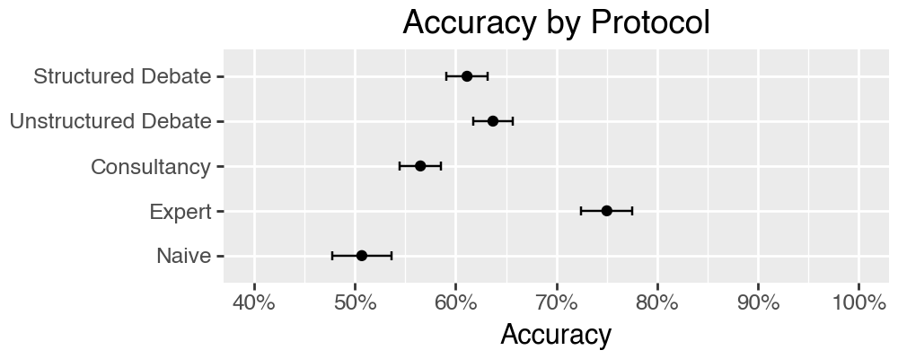
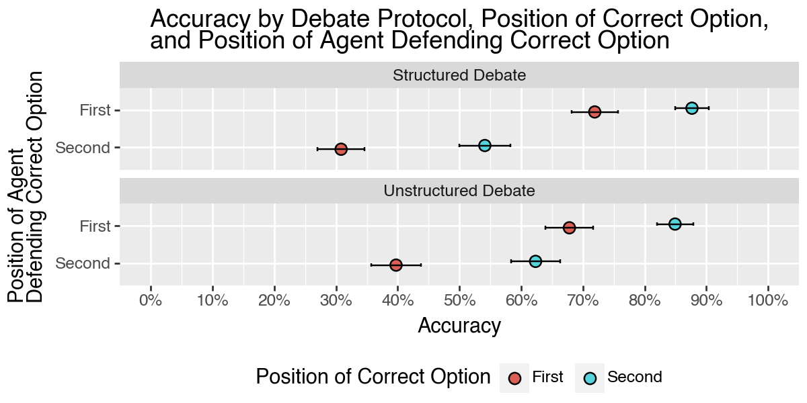
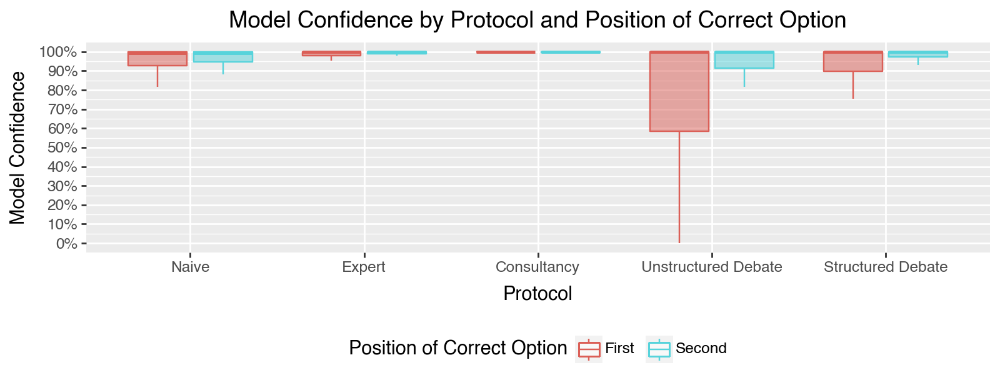

# Positional Bias in AI Alignment Debates
## Executive Summary
* Debate has been proposed as a method of AI oversight whereby a less capable agent, say a human operator, leverages debate between two more capable systems to obtain outcomes better aligned with the less capable agent's preferences.
* Here, we investigate the impact of positional bias on the outcome of debates involving an LLM judge powered by gpt-o-mini and report two primary findings:
  1. The AI judge is more likely to select the correct option when it is presented second across all debate protocols tested.
  2. The AI judge is more likely to side with the first agent to speak across all debate protocols tested.
* We tested a new debate protocol whereby debaters must respond with a well-defined structure, called **Structured Debate**, and find that it leads to about the same accuracy as the **Unstructured Debate** protocol when the correct option is presented first, but worse when the correct option is presented second.   
* You can view the debate transcripts for all experiments performed [here](https://quality-data-debate-app.onrender.com/).
* Finally, we note that our implementation of the debate protocols using AutoGen addresses one important limitation of previous work: as far as we can tell, it eliminates self-defeating behavior in all the samples we examined. This is achieved by providing scaffolding to the agents in the form of prompts that guide the agents through each round of debate. [AutoGen](https://microsoft.github.io/autogen/stable/index.html) makes creation of this scaffolding much easier to implement.    

## Data
* For our experiments, we followed previous work by using a subset of the [QuALITY dataset](https://github.com/nyu-mll/quality), which is a dataset of human-curated multiple-choice questions on articles about 7K tokens long.
* We applied the same filters outlined in section D.1 of the paper [Debating with More Persuasive LLMs Leads to More Truthful Answers](https://arxiv.org/abs/2402.06782) and one additional one:
  * We ensured that there was unanimous agreement among human reviewers about which option was the "best distractor".

| # of Questions | # of Articles |
|----------------|---------------|
| 146            | 76            |

## Methodology
* We implemented the following debate protocols using AutoGen:
  * **Naive Judge**: An LLM judge is given only the article title, but not the body.
  * **Expert Judge**: An LLM judge is given both the article title and body.
  * **Consultancy**: An LLM judge receives only the article title, and interacts with a consultant agent that is given a random position to argue.
      * Round 1: The consultant gives its opening argument.
      * Round 2-4: The judge asks the consultant questions.
      * Round 5: The consultant gives its closing argument.
  * **Unstructured Debate**: An LLM judge receives only the article title, and interacts with two agents that are each given a distinct position to argue.
      * Round 1: Agent 1 and 2 give their opening arguments.
      * Round 2: Agents provide rebuttals.
      * Round 3-4: The judge asks the agents questions.
      * Round 5: Agents give their closing arguments.
  * **Structured Debate**: The same as the Unstructured Debate, but agents must respond with a well-defined structure, as outlined in the pydantic model [here](./src/debate_for_ai_alignment/pipelines/debate/structured_debate/models.py).
* To see concrete examples of the debate protocols, see the [debate transcripts](https://quality-data-debate-app.onrender.com/).
* We ran each debate protocol with the following variations for a total of 2,336 trials.
  * **Correct Option Position**: The correct option is presented first or second.
  * **Agent Order**: The agent arguing for the correct option speaks first or second.
  * **Consultant Type**: The _truthful_ consultant argues for the correct option, while the _deceptive_ consultant argues for the incorrect option.

## Results
### Accuracy by Protocol and Correct Option Position

* Error bars represent standard error of the mean.
* As expected, the naive judge performs at about chance level, while the expert judge performs the best, with an accuracy of about 75%.

* Across all debate protocols, the AI judge is more likely to select the correct option when it is presented second.

### Accuracy of Consultancy

* Again, we see that the AI judge is more likely to select the correct option when it is presented second.
* The AI judge is very likely to side with the consultant, regardless of the consultant's position.

### Accuracy of Debate

* The AI judge is more likely to side with the first agent that speaks for both the Unstructured and Structured Debate protocols.
* The Structured Debate protocol performs worse than the Unstructured Debate protocol when the agent arguing for the correct option speaks second.

## Model Confidence

* The AI judge is more confident when the correct option is presented second across all debate protocols.
* Unstructured Debate induces greater model uncertainty than Structured Debate and indeed all other protocols, including Naive. This is a rather puzzling finding considering that in the Naive case, the AI judge is given less information than in the Unstructured Debate case.
